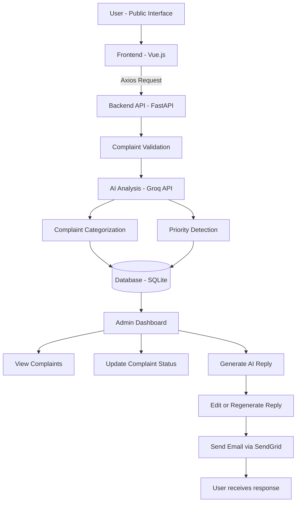

# Complaint Triage System

An AI-powered web application designed to manage and prioritize customer complaints efficiently.

The system allows users to submit complaints through a public interface, while administrators can review, prioritize, and respond to complaints through a secure dashboard. AI is used to categorize complaints and determine their priority to assist administrators in faster decision-making.

---

## Features

### User Interface
Users can submit complaints through a public interface.  
Each complaint is automatically analyzed using AI to determine:

- Complaint category
- Complaint priority level

### Admin Dashboard

Administrators log in using secure authentication and can:

- View all submitted complaints
- Update complaint status
- Generate AI-powered reply drafts
- Edit or regenerate responses
- Send replies via email

---

## Tech Stack

### Backend
- FastAPI
- SQLAlchemy
- SQLite (local development database)
- Passlib (bcrypt password hashing)
- Groq API (AI-powered complaint analysis)
- Twilio SendGrid API (email delivery)

### Frontend
- Vue.js
- Axios
- Vite

### Authentication
- JWT (JSON Web Tokens)

---

## System Architecture



---

## Project Structure

```
Complaint-Triage-System
│
├── backend
│   ├── app
│   │   ├── main.py
│   │   ├── models
│   │   ├── routes
│   │   └── services
│   │
│   ├── requirements.txt
│
├── frontend-vue
│   ├── src
│   ├── components
│   ├── pages
│   └── vite.config.js
│
└── README.md
```

---

## Configuration

Sensitive values are managed using environment variables.

```
GROQ_API_KEY=your_groq_api_key
SENDGRID_API_KEY=your_sendgrid_api_key
SENDGRID_FROM_EMAIL=verified_sender@example.com

JWT_SECRET_KEY=your_secret_key
ADMIN_EMAIL=admin@example.com
ADMIN_PASSWORD=strongpassword
```

---

## Running the Backend (Local)

```
cd backend
python -m venv venv
source venv/bin/activate
pip install -r requirements.txt
uvicorn app.main:app --host 0.0.0.0 --port 8000
```

API documentation will be available at:

```
http://localhost:8000/docs
```

---

## Running the Frontend (Local)

```
cd frontend-vue
npm install
npm run dev
```

Frontend will run at:

```
http://localhost:5173
```

---

## Notes

- Admin routes are protected using JWT authentication.
- API keys and credentials are not stored in the repository.
- Each user runs the project using their own local database instance.

---

## Limitations

- The system is designed as a prototype and not intended for production without further testing.
- AI-based categorization may not always be perfectly accurate.
- SQLite is used for local development and may need to be replaced with a scalable database for production.
- Email delivery depends on external SendGrid API availability.

---

## Author

**Anushka Singh**  
CSE Student